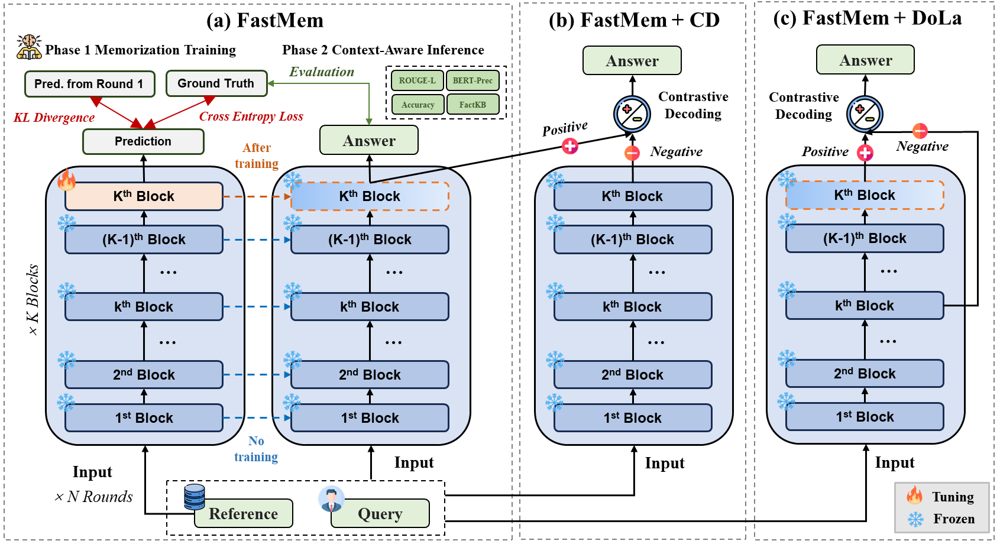
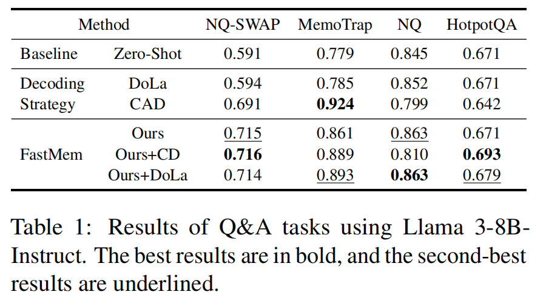
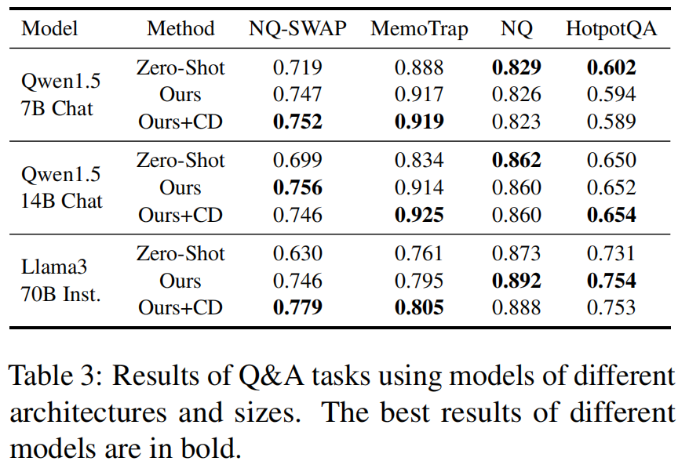
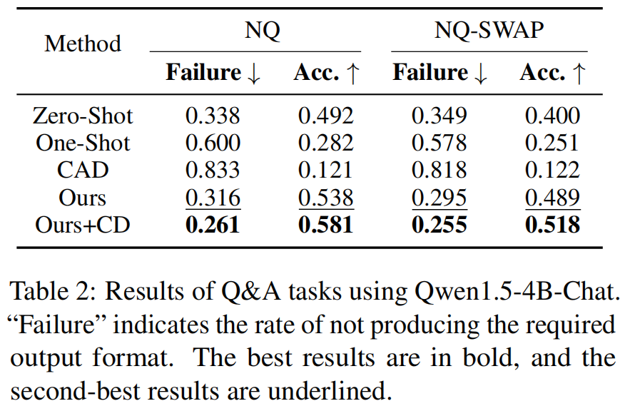
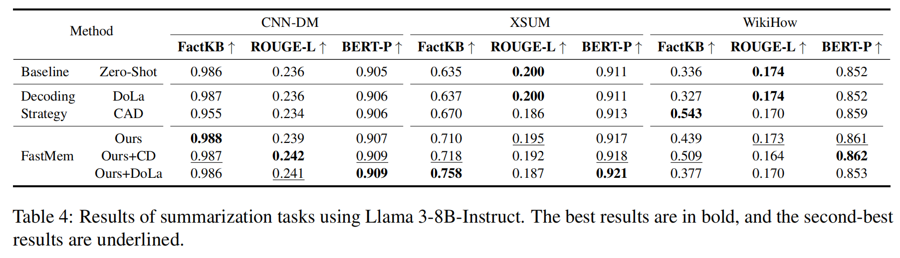

<h1 align="center">
    FastMem: Fast Memorization of Prompt Improves Context Awareness of Large Language Models
</h1>
<p align="center">
    <a href="https://opensource.org/license/apache-2-0/">
        
    </a>
    <a href="">
        
    </a>
</p>

This is the official code of the paper **FastMem: Fast Memorization of Prompt Improves Context Awareness of Large Language Models**
 by *Junyi Zhu, *Shuochen Liu, Yu Yu, Bo Tang, Yibo Yan, Zhiyu Li, Feiyu Xiong, Tong Xu, Matthew B. Blaschko

If you find this repository or paper useful, you can cite
```
@misc{zhu2024fastmem,
      title={FastMem: Fast Memorization of Prompt Improves Context Awareness of Large Language Models}, 
      author={Junyi Zhu and Shuochen Liu and Yu Yu and Bo Tang and Yibo Yan and Zhiyu Li and Feiyu Xiong and Tong Xu and Matthew B. Blaschko},
      year={2024},
      eprint={2406.16069},
      archivePrefix={arXiv},
}
```
## Overview

TL;DR: **FastMem** maximizes the likelihood of the prompt before inference by fine-tuning only the last Feed-Forward Network (FFN) module. This targeted approach ensures efficient memorization without overfitting, significantly improving the model's ability to comprehend and accurately follow the context.

<p align="center"></p>

## Dependencies

The required dependencies and their versions can be found in the [`requirements.txt`](requirements.txt). The main packages are `pytorch`, `transformers` and `accelerate`.

To install all the required packages along with their dependencies, run
```sh
pip install -r requirements.txt
```

## Run

We evaluate **FastMem** on Q&A and summarization tasks that require LLMs to respond based on the given context. Our experiments include evaluations of popular open-source instruction fine-tuned LLMs from the Llama 3 series (8B-Instruct and 70B-Instruct) and the Qwen 1.5 series (4B-Chat, 7B-Chat, and 14B-Chat).


### Datasets
The complete test dataset has been uploaded to the repository at the path [`./eval/data/`](./eval/data/). Below is an example input to our method (from NQ-Swap for Q&A and CNN-DM for summarization). 

**NQ-SWAP**
```json
{
     "input": "who sings love will keep us alive by the eagles",
     "context": "`` Love Will Keep Us Alive '' is a song written by Jim Capaldi , Paul Carrack , and Peter Vale , and produced by the Eagles , Elliot Scheiner , and Rob Jacobs . It was first performed by the Eagles in 1994 , during their `` Hell Freezes Over '' reunion tour , with lead vocals by bassist Timothy B. Schmit .",
     "answer": "Timothy B. Schmit",
     "sub_context": "`` Love Will Keep Us Alive '' is a song written by Jim Capaldi , Paul Carrack , and Peter Vale , and produced by the Eagles , Elliot Scheiner , and Rob Jacobs . It was first performed by the Eagles in 1994 , during their `` Hell Freezes Over '' reunion tour , with lead vocals by bassist Yuliya Snigir .",
     "sub_answer": "Yuliya Snigir"
},
```
**CNN-DM**
```json
{
     "article": "Fabio Borini may not have had much success climbing up the pecking order in the Liverpool attack but the Italian striker had no problems scaling the heights at Delamere Forest Park on Tuesday. The former Swansea striker made the most of the warm weather as he spent the day at adventure park Go Ape at the Cheshire forest. Borini appeared as a second-half substitute in Liverpool's 2-0 win against Newcastle at Anfield on Monday as clearly still had plenty of energy left as he was pictured taking part in a climbing exercise...",
     "summary": "Fabio Borini visited Go Ape adventure park in Delamere Forest on Tuesay . The Liverpool striker shared Instagram pictures from his day out . Borini came on as a substitute for Liverpool against Newcastle on Monday ."
}
```
### Running FastMem on Q&A and summarization tasks

All running scripts are saved in [`./scripts`](./scripts). Run `bash run_qa.sh` or `bash run_summary.sh` to reproduce our results. To evaluate different models and tasks, please modify hyperparameters `model_name`, `model_name_or_path`, `task_type`, `dataset_name` and `data_path` accordingly. 

For Q&A tasks, the real-time accuracy is calculated and presented in the terminal. For summarization, we provide `evaluate_summary.py` to analyze the results. To do this, your need to modify the result path in `evaluate_summary.py` and run the code to calculate the metrics.

**Note:** Given the various characteristics of different models and datasets, testing under respective hyperparameters may be needed to achieve optimal results. In the bash file we adopt the optimal hyperparameters for Llama 3-8B-Instruct.

> [!Important]
> 1. To evaluate FastMem + Contrastive Decoding(CD), set `choose_cd` to True.
> 2. To evalaute FastMem + DoLa, set `choose_dola` to True. Additionally, you need to replace the file in the transformers library (`[path/to/env]/python3.11/site-packages/transformers/generation/utils.py`) with `../src/transformers_generation/utils.py`. Currently, this decoding strategy only supports Llama 3-8B-Instruct.
> 3. To test our method on a new dataset or other models, you can obtain the corresponding optimal hyperparameters using the `search_qa.sh` or `search_summary.sh` script. The modifications regarding the model (e.g. `model_name`) and dataset (e.g. `dataset_name`) in the bash file are the same as mentioned above.

## Results for Experiment

<p align="center"></p>
<p align="center"></p>
<p align="center"></p>
<p align="center"></p>

More details and analyses about experimental results can be found in our paper.

## Acknowledgement
Our code have been developed based on [Stanford Alpaca](https://github.com/tatsu-lab/stanford_alpaca), [DoLa](https://github.com/voidism/DoLa). We thank these valuable works.


## Contact Us

* Junyi Zhu: junyizhu.ai@gmail.com
* Shuochen Liu: liusc@iaar.ac.cn
* Bo Tang: tangb@iaar.ac.cn
